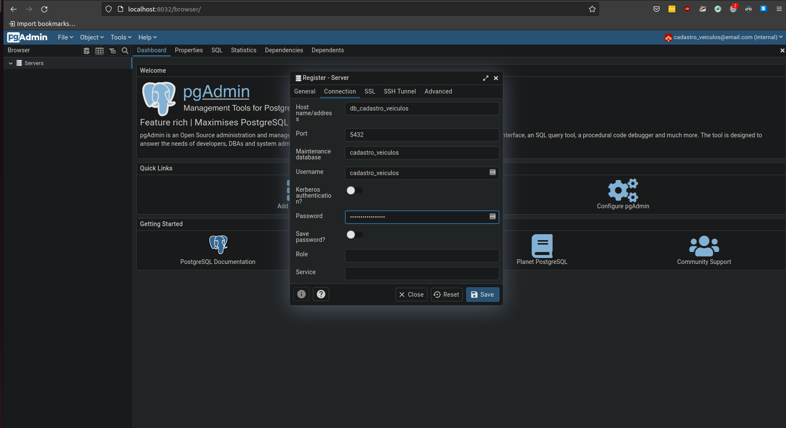

# desafio-tecnico-tinnova

REST API para manter e cadastrar veículos.

O projeto não segue a risca os conceitos de `Clean Architecture`, no entanto, tenta ao máxima seguir a sua filosofia, uma vez que possuí de forma desacoplada seus módulos, classes e métodos.

## Arquitetura

Os conceitos de `Clean Architecture` e de `Arquitetura de Microsserviços` não foram seguidos a risca, mas sim, adapatados a proposta do desafio técnico. Uma camada de `ORM`, a exemplo do [SQLAlchemy](https://www.sqlalchemy.org/) poderia ter sido utilizada antes do banco de dados desacoplando ainda mais o sistema e isolando as regras de negócio. Na arquitetura proposta do banco de dados, um novo banco poderia facilmente ser trocado, por exemplo, ao contrário de um PostgreSQL poderia ter sido utilizado um MongoDB e o que restaria a ser feito neste caso é reescrever alguns métodos da classe [Database](cadastro_veiculos/database/__init__.py).

## Documentação

Todo o código foi documentado utilizando [Sphinx](https://www.sphinx-doc.org/en/master/), é possível acessar a documentação técnica do projeto acessando os endpoints abaixo:

[Cadastro-Veiculos-APi](http://localhost:7000/v1/docs)

## Pré-requisitos

Clone este repositório

```bash
git clone https://github.com/kevinsantana/desafio-tecnico-tinnova.git
```

Para executar o projeto é preciso que [docker](https://docs.docker.com/) e o [docker-compose](https://docs.docker.com/compose/) estejam devidamente configurados, e que um arquivo `.env` com a variável `MARCAS=Honda,Toyota` seja gerada. Aqui deve-se indicar as marcas dos veículos utilizados para validação.

## Execução

Com o `docker`, `docker-compose` e um arquivo `.env` gerado com a variável `MARCAS`, basta executar:

```bash
make run
```

Com a aplicação em execução, é necessário executar o _script_ de criação do banco de dados. Para isto, execute os passos a seguin:

1. Acesse o endereço [pgAdmin](http://localhost:8032/) com as credenciais `cadastro_veiculos@email.com` e `cadastro_veiculos`


2. Clique em `Servers` depois em `Register` depois em `Server`


3. Na janela `Register - Server` na aba `General` dê um nome para o banco de dados


4. Na aba `Connection`, preencha com as informações abaixo

| Campo       | Valor     |
| :------------- | :----------: |
|  Hostname/address | db_cadastro_veiculos  |
| Port   | 5432 |
| Maintenence database   | cadastro_veiculos |
| Username   | cadastro_veiculos |
| Password   | cadastro_veiculos |



5. Com a conexão criada clique em `Servers` depois na conexão nomeada no passo anterior, clique em `Databases` depois em `cadastro-veiculos` e por último em `Schemas` com o botão direito clique em `Query Tool`


6. Copie o conteúdo do arquivo [create.sql](cadastro_veiculos/scripts/create.sql) cole na nova aba aberta a direita `Query Tool` e clique em `Execute/Refresh (F5)`


## Testes

Após executar a aplicação e o script do banco de dados, com os _containers_ em execução, execute o seguinte comando:

```bash
docker container exec -it cadastro_veiculos pytest -v
```

### Autoformatter

O projeto conta com o [Black](https://github.com/psf/black) que é um `autoformatter`, formatando o código caso exista algum trecho de código que não siga a PEP8. Para executá-lo basta rodar o seguinte comando no terminal:

```bash
make black
```

## Deploy

Com a aplicação _dockerizada_ e testada, é possível efetuar o _deploy_ em um orquestrador de _containers_ a exemplo do [Kubernetes](https://kubernetes.io/pt/), ou mesmo, com o orquestrador nativo do Docker [Swarm](https://docs.docker.com/engine/swarm/).

## Construído Com

* [psycopg2](https://www.psycopg.org/)
* [black](https://github.com/psf/black)
* [loguru](https://github.com/Delgan/loguru)
* [pydantic](https://pydantic-docs.helpmanual.io)
* [fastapi](https://fastapi.tiangolo.com)
* [uvicorn](https://www.uvicorn.org)
* [gunicorn](https://gunicorn.org)
* [requests](https://requests.readthedocs.io/en/master/)
* [sphinx](https://www.sphinx-doc.org/en/master/)

## Versionamento

O versionamento segue o padrão do [Versionamento Semântico](http://semver.org/).

## License

Todos os direitos são reservados ao autor Kevin de Santana Araujo.

## Outras informações

* Caso tenha alguma dúvida em relação ao projeto, ou queira contribuir com sugestões ou críticas, abra uma [issue]() ou procure o desenvolvedor através do email kevin_santana.araujo@hotmail.com
